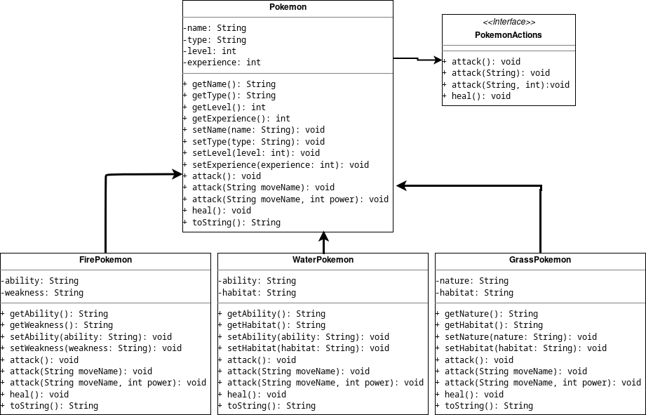

# Pokemon Desk App

## Introduction

The **Pokemon Desk App** is a Java-based desktop application that allows users to manage and interact with a collection of Pokemon. The application provides features for adding, searching, editing, and deleting Pokemon, as well as performing actions like attacking and healing.

## Methodology

The application is built using Java and Swing for the graphical user interface (GUI). It employs a modular and object-oriented design, allowing for easy extension and maintenance. The project is organized into several packages, each responsible for specific functionalities.

## Class UML Diagram

The diagram illustrates the relationships between the `Pokemon`, `FirePokemon`, `WaterPokemon`, and `GrassPokemon` classes. `FirePokemon`, `WaterPokemon`, and `GrassPokemon` inherit from the base `Pokemon` class, and each has additional attributes and methods.

The `Pokemon` class implements the `PokemonActions` interface, ensuring a common set of actions across all Pokemon.

## Uses

The Pokemon Desk App can be used to:

- **Display Pokemon:** View a list of all Pokemon with relevant details.
- **Add Pokemon:** Add new Pokemon to the collection.
- **Search Pokemon:** Find and display information about a specific Pokemon.
- **Edit Pokemon:** Modify the details of an existing Pokemon.
- **Delete Pokemon:** Remove a Pokemon from the collection.
- **Attack and Heal:** Perform actions such as attacking and healing for each Pokemon.

## Conclusion

The Pokemon Desk App provides a user-friendly interface for managing and interacting with Pokemon. Its modular design allows for easy expansion and customization. The application leverages Java's object-oriented features to create a flexible and extensible system.

